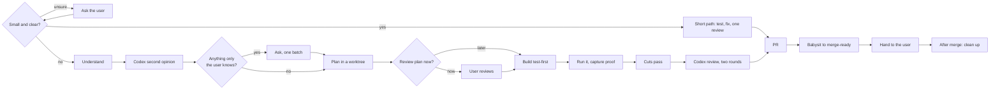

# Build

The user owns the problem, the taste and the veto. You own everything else. Anything the code, the docs, an experiment, the web or Codex can answer, you answer yourself.

What can't be fixed later is building the wrong thing. So every interaction with the user serves one purpose: making sure your picture of the problem and the solution matches theirs. Everything else, you decide and write down.



If a `.worktrees/p<n>-*` worktree already holds a plan for this, resume at the first step that isn't done. Settled things stay settled.

**The manifest.** Read `.agents/project.md` before anything else. It names this repo's paths, tracker, commands, isolated stack and workflow, described in the `setup` skill's [manifest.md](../setup/manifest.md). If it's missing, run `/setup` first. Below, *Plans*, *Verify*, *the base branch* and the like mean that line of the manifest.

`$S` below is this skill's directory: `S="${CLAUDE_SKILL_DIR}"`.

## 0. Size it first

The full workflow is for work where a wrong picture is expensive. Most changes aren't. Decide which path this is, but read first. On either path, read the manifest's *Routing* file and every doc it names for the area, the ticket with its comments and linked issues if there is one, and the code involved. Something that looks like an obvious fix may be deliberate, and the docs say why.

**The full workflow** (§1 onward) is required if any of these hold. They win over everything below.

- It adds or changes behaviour in a way that neither the request nor what you just read settles. Placement, wording, defaults, edge cases and failure handling count only when the request, the docs and the existing code leave them open.
- There is more than one reasonable approach, and the user would care which.
- It touches auth, data or migrations, infrastructure, or CI.
- It spans more than one component (backend, a UI, the worker, infra), or goes past roughly 150 changed lines.
- The ticket's "done" needs pinning down, or the docs or ticket contradict the request.

**The short path** is for everything else. Typical cases: a bug fix restoring the behaviour the docs describe, a copy tweak, a change the request specifies completely, and edits to skills, docs or config.

**When in doubt, ask.** Put it to the user in one question, with your recommendation first and one line on why. Once they choose, that's settled. If the short path meets one of the triggers above, stop and say so, then switch.

The short path:

1. Work on a branch in its own worktree (`<Worktrees>/<slug>`, branch `fix/<slug>` or `chore/<slug>`), with the ticket ID after the prefix when there is one. There's no plan file. Run *Install*, and add `.build/` to `$(git rev-parse --git-common-dir)/info/exclude` if it isn't already there. The review in step 5 writes to `.build/`, and `codex.sh` refuses a dirty tree.
2. For code: a failing test that shows the problem, then the fix, then a commit. For a bug, the test is its regression test. Prose-only changes (docs, skills) have nothing to test.
3. Update the reference or data-flow doc if the behaviour it describes changed.
4. Run *Verify*, plus each of the *Extra checks* whose condition the change meets.
5. Run the cuts pass and one Codex review round (§6, same brief), and handle their findings as in §6. If a blocker needs a design decision, it wasn't a short-path change, so switch to the full workflow.
6. Ship as in §7, without the proof media unless something visible changed. Put a short what-and-why in the PR body (or the merge commit message). The review result and anything not done go in your hand-off to the user, not the body.

## 1. Understand

Read before you ask. Start with the *Routing* file and every document it names for this work, then the code involved, the *Plans index*, and the plans in other worktrees (`git worktree list`). Another plan may already own part of this.

Get evidence, not opinions. Reproduce the problem, measure it, and read what the code really does. When a choice turns on a fact, run a cheap spike in the scratchpad. When the right approach isn't obvious, compare real alternatives, including the smallest change that could work.

Then write the **shared picture**, the thing the user will confirm. It's working when the user reads it and recognises their own thinking. Write it for someone who has three minutes. It's the first part of the plan in §3: *What you said*, *Where I might be wrong*, *Done when*, and the approach drawn wherever a drawing is clearer than words, with the rejected alternative in one line.

If the change is big, or the code it touches resists it, consider suggesting `/improve-architecture` pointed at this work ("how could the code make this change easy?") before planning.

**A ticket, if there is one.** The user may name a ticket matching the *Key pattern*, paste its link, or be on a branch whose name carries one. If so, read it (the tracker's connector or CLI, or the *Ticket URL*), including its comments and linked issues. It's part of the problem statement. If there's no ticket, don't invent one or ask for one.

If the request names a solution ("add a cache") and the context doesn't say what it's for, find out what it buys, so you solve the need.

## 2. Second opinion, then ask

Before you put a question to the user, put it to Codex. Write `.build/consult.md` (in the scratchpad, or in the worktree once it exists) with the shared picture, the alternatives and your draft questions. Ask Codex what's wrong with the approach, which of the questions the code or docs already answer (and where), and what you missed. Run it in the background and wait for the notification. Don't poll.

```bash
"$S/codex.sh" consult "$PWD" .build/consult.md .build/consult-answer.md
```

Treat it as a second opinion, not a verdict. Whatever it settled, you settle. What's left are the things only the user can say: a goal, a trade-off between their goals, money, taste, or a conflict with something they decided. Show the shared picture (in chat, or as the published picture from §3 when the work gets one) and ask those in one batch, with your recommended answer first (`AskUserQuestion` in Claude Code). If nothing is left, don't ask. Show the picture and carry on.

A technical directive from the user ("use X") beats a standard. If it contradicts one, say in a sentence what the standard protects, then follow the directive and record it as a standards change. Every directive goes into the plan under **Your directives**, quoted: it's settled, and reviewers don't reopen it.

## 3. Plan

**Worktree.** Number the plan one above the highest `P<n>` anywhere. Check *Plans* on the base branch, in every worktree, and on every branch (`git log --all --name-only --format= -- '<Plans>P*'`). Create `<Worktrees>/p<n>-<slug>` on branch `feat/p<n>-<slug>` from an up-to-date base branch. With a ticket, its ID goes after the number everywhere: `p19-proj-12-<slug>`, `feat/p19-PROJ-12-<slug>`. Copy the root `.env` into it if there is one, run *Install*, and add `.build/` to `$(git rev-parse --git-common-dir)/info/exclude`.

**The plan has two readers, so it has up to two layers.**

- **The record**, `<Plans>P<n>-<slug>.md`, always. It's for the build, the reviewers and the git history: scenarios, decisions and invariants, written tersely.
- **The picture**, for the user: the record rendered as an HTML page, committed beside it, as [`picture.md`](picture.md) describes. Make one when the work spans more than one component, changes UI, or has a state or flow the user has to picture. For smaller work, the record's first screen is the picture.

With a ticket, the file is `P<n>-<ticket ID>-<slug>.md` (for example `P19-PROJ-12-answer-export.md`). The lines under the title are `Ticket: [PROJ-12](<Ticket URL>)` when there's a ticket, `Picture: <artifact url>` when there's a picture, and the plan-review line from the gate. Then, in this order, with the user's part first:

- `## Summary`: what and why, in two or three sentences.
- `## What you said`: the user's words, quoted verbatim with their source, each followed by `→` and your reading of them. Never put quotation marks around words they didn't write: a decision you only have secondhand is a paraphrase, labelled as one.
- `## Where I might be wrong`: the assumptions that would change what gets built, each with **if not:** and what would change. Delete them as the user confirms them, and move any the user corrects into the plan.
- `## Done when`: numbered scenarios, `P<n>-Scenario1`, `P<n>-Scenario2` and so on. Each is an observable behaviour, failure paths included. They're the build's work list, the test names and the proof checklist. Always write the full prefix so one grep finds plan row, test and commit.
- `## Solution`: diagrams first. Then two lists, kept apart so it's clear who decided what:
  - `### Your directives`: the user's technical decisions and the ticket's constraints, quoted. They're settled, and reviewers never report them as findings.
  - `### My decisions`: a table of choice, rejected alternative, and why. Add feature-local invariants where they matter. Skip anything the standards or the existing code already decide.
- `## Standards changes`: only when there are some. The exact new wording for each file under *Standards*, as blockquotes. They land with the code, never earlier.
- `## Out of scope`, and `## Open questions` when there are any.
- `## Changed during implementation`: empty for now. The build adds a line for each departure.

A plan that keeps growing usually means the feature should be split, or that you're describing mechanics the code will show. Put heavy research in a paired `R<n>-<slug>.md`. Add the index entry, render the picture if there is one, and commit them together as the worktree's first commit.

**Plan gate.** Unless the user already said to just build it, ask once, with the picture's link when there is one:

1. **Build it — I'll review the plan with the PR** (recommended; "with the merge" when *Landing* is `local merge`)
2. Let me review the plan first

Recommend option 2 instead when an assumption you couldn't settle would change the shape of the feature. Comments on the picture are handled as `picture.md` says.

Record the answer in the plan, on its own line under the title (and the ticket line): `Plan review: with the PR` (or `with the merge`) for option 1, or when the user said to just build it. Write `Plan review: before build` only once the user has actually reviewed it.

## 4. Build

Follow the *Routing* file and *Standards*. One scenario at a time, in plan order:

1. **Red.** Write the scenario's tests and watch them fail for the right reason. Include the failure modes that apply to it (bad input, concurrency, cancellation, a dependency refusing or hanging), and for anything crossing a trust boundary, the abuse case.
2. **Green.** Write the least code that passes, following the standards.
3. **Commit**, naming the scenario: `P19-Scenario3: refuse a second vote while one is in flight`.

**Every bug gets a regression test**, wherever it turns up: your own testing, proof capture, Codex, CI, or the user. Write a failing test that reproduces it, then fix it, then commit naming the bug. Look for the same defect elsewhere.

**When reality disagrees with the plan**, decide using the plan's goals, then add a line under `## Changed during implementation` straight away. Ask only when a goal itself would have to move, or two goals conflict.

**Docs move with the code.** A behaviour change isn't finished until its doc under *Reference docs* or *Data flows* agrees with it, in present tense. Apply the plan's standards changes in the commit that first relies on them.

Build in this session. Use subagents only for independent read-only digging. Nothing waits on Codex.

## 5. Run it and capture proof

Tests prove the code does what the tests say. Running it proves it does what the user pictured.

**Start the worktree's own stack**, with its own database, so it can't touch the user's processes, data or job queue. Run the manifest's *Isolated stack* recipe with `N=<plan number>` and `PORT=<a free port>`. It records every PID it starts in `.build/pids`. Wait until *Ready when* succeeds before anything else. If the change is in a path the isolated stack can't exercise (real third-party sign-in, say), the proof is that path's tests plus the matching *Extra checks*.

**Capture.** Write a throwaway Playwright script in `.build/proof/` against `http://localhost:$PORT` that drives each `Done when` scenario the way a user would. Screenshot every state that matters. For interactions, record video with `browser.newContext({ recordVideo: { dir } })`, and close the context before using the file. Then convert each clip:

```bash
ffmpeg -y -i in.webm -vf "fps=10,scale=960:-1:flags=lanczos,split[a][b];[a]palettegen[p];[b][p]paletteuse" out.gif
```

For backend-only behaviour, the proof is the real request and response, or the log lines, as text.

**Compare.** For each scenario, write down what you observed next to what the plan promised, and the commit it was observed at. A mismatch is a bug (§4). If something matches the plan but would surprise the user, flag it too.

When code changes later (review fixes, the merge from the base branch, CI fixes), recapture the scenarios it affects, so the PR shows the final commit.

## 6. Cut it down, then review by Codex

Cuts come first, so the review reads only the code that stays and checks what cutting broke. The prompts live in this skill: [`review-rules.md`](review-rules.md) for both passes, [`review-cuts.md`](review-cuts.md) for the cuts and [`review-bugs.md`](review-bugs.md) for the review. Change them there, not in a brief. Each script adds the target itself: the whole diff from the merge base with `origin/main` to the commit it reads.

**The cuts pass.** Claude Sonnet 5.5 at `medium` effort, with read tools only, assumes the change is bloated and reports only cuts and cleanups. Commit everything, write `.build/review/brief-cuts.md` with what the change does, the plan's path and the choices the user made on purpose, and run it in the background:

```bash
"$S/cuts.sh" "$WT" "$WT/.build/review/brief-cuts.md" "$WT/.build/review"
```

It prints the cuts; each one's scenario and fix are in `cuts.json`. Take every cut and cleanup. The code should be as small as the plan allows. Skip one only when it would remove behaviour the plan asks for or make the design worse, and give the reason in your hand-off to the user. Run the tests and commit the cuts before round 1.

**The review.** Codex is the reviewer: `gpt-6.1-sol` at `medium` effort, read-only, looking only for what's wrong. There are two rounds, and `codex.sh` refuses a third. Each is a fresh session over the whole diff. Commit everything before each round. `codex.sh` refuses a dirty tree, and it records the reviewed commit in `round-<n>.sha` and the merge base its diff started from in `round-<n>.base`.

Write `.build/review/brief-<n>.md` with only what this round adds:

- The round number.
- What the change does, in a few lines, and the plan's path.
- The plan's **Your directives**, and any other choice the user made on purpose, so they aren't reported as omissions.
- In round 2: every round-1 blocker, what changed for it and in which commit, and your reason for each one you dismissed.

```bash
"$S/codex.sh" review "$WT" "$WT/.build/review/brief-<n>.md" "$WT/.build/review" <n>
```

Run it in the background and wait. It prints the blocker count. The detail is in `round-<n>.json`.

**Handle every finding of round 1:**

- **Blockers (P1, P2)**: a confirmed one gets a regression test, then the fix, then a commit naming the finding id. A misread one: cite the line that disproves it. One that's by design: cite the plan or standard that decided it.
- **P3 bugs**: fix them when the fix is small and in a file you're already changing. List the rest in your hand-off to the user.
- If a fix would change agreed behaviour (not restore it), stop and ask the user.

**Round 2** reviews the whole diff again in a fresh session. If it has no blockers, the review is done. If it has blockers, handle them the same way, then stop reviewing: say in your hand-off to the user which fixes came after the final round. The same goes for code that changes after round 2 (CI fixes, conflicts from merging the base branch).

## 7. Ship

If the manifest's *Landing* is `local merge`, run "Nothing ships red" below, then land it as [local-merge.md](local-merge.md) says, in place of everything from **Media** on.

**Nothing ships red.** Merge the up-to-date base branch into this one (don't rebase a pushed branch). Then, on the combined result, run *Verify* and each of the *Extra checks* whose condition the change meets, with the stack from §5 up for any that need it. If the plan has a picture, check it's current: `node "$S/render-picture.mjs" --tokens <Tokens> --check <Plans>`.

Every PR check must be green too. A failure is a bug (§4), not a retry. If the change touched a trust boundary, say so in the PR.

**Media.** Publish the proof files you captured to the *Proof media branch*, so they never reach the base branch. It prints a Markdown image line for each.

```bash
"$S/publish-media.sh" p<n>-<slug> <each captured file>
```

**The PR.** Push and open it with `gh`. The title follows the repository's commit style, with the ticket ID when there is one: `feat(PROJ-12): export answers as Markdown`. Write the body for the reviewer, who didn't watch. It carries the context they need to review the change, and nothing about how it was built or reviewed: no cuts, review rounds, findings or dismissals, and no "not done" list. Anything the reviewer must know, such as a deliberate limitation, a risk, or a step they must take, goes in **What and why**.

- **What and why**, from the plan's summary, with the ticket link and a link to the committed picture when there are any.
- **See it working**: each GIF or screenshot under the scenario it proves, with one line on what it shows and the commit it was captured at.
- **Plan vs. built**: each scenario ✅ or ❌, plus every `Changed during implementation` line.
- The last line: the *PR footer*, when the manifest has one.

Open the PR and check that the images render. If they don't, switch to the relative form `../blob/<Proof media branch>/<path>?raw=true`.

**Babysit it until it's ready to merge.** Opening the PR isn't the end. Stay with it until it's **merge-ready**. Agents never merge: the user reviews and merges every PR. Merge-ready means:

- every PR check is green at the head,
- every review thread is settled: a person's thread is answered, and a bot's is resolved (see below),
- the branch contains the current base branch and has no conflicts.

Run the watches in the background and act on each notification. Don't poll in a loop.

- **A check fails.** It's a bug (§4): reproduce it, write a regression test, fix it. Don't re-run it and hope. A check that fails and then passes with no change is flaky, and that's a bug too.
- **A review comment arrives**, from a person or a bot such as Copilot. Check it against the code before you act.
  - If it's right, write a regression test, fix it, commit naming the comment, and reply with the commit.
  - If it's wrong, reply with the line, the plan or the standard that shows why.
  - If the fix would change agreed behaviour, ask the user first (§6).
  - Resolve a bot's thread only once it's settled: the fix is committed and the checks are green on it, or your dismissal cites the evidence. A thread you've only acknowledged, or one waiting on the user's decision, stays open. Leave a person's thread for them to resolve.
- **An automatic bot review hasn't arrived.** If the repo requests one (Copilot, say), give it about 30 minutes, handling whatever else comes in meanwhile. Then carry on without it, and say so in your report. Silence is neither approval nor a reason to wait longer.
- **The base branch moves on, or the branch conflicts.** Merge it in (don't rebase a pushed branch) and rerun the checks from "Nothing ships red".
- **After any code change**, recapture the proof it affects (§5) and update the PR body so it describes the final commit. If the review rounds are over (§6), note what changed after the last one for your hand-off to the user.

**Hand it to the user** once it's merge-ready: send them the link and a short summary (what it does, what the proof showed, the review result: cuts skipped and why, fixes made after the final round, findings dismissed, open P3s, and anything not done). Then stop watching. If the build was harder than it should have been (a long search, a mistake a check could have caught, a step of this skill that didn't fit), suggest `/retro` in one line.

Babysitting ends at merge-ready, not at the merge. Pick the PR up again when the user reviews it, comments or asks, and babysit it back to merge-ready. The base branch moving on while it waits doesn't count, unless the user asks you to bring it up to date.

**Stop the stack.** Kill the PIDs in `.build/pids`. Leave the rest (the cleanup) until the PR merges, in case a fix needs recapturing.

**After the user merges it**, if they ask you to clean up: check with `gh pr view <n> --json state,headRefOid` that it's `MERGED` at the head you pushed. Then:

- Kill anything left in `.build/pids`, and run the *Isolated stack*'s *Cleanup* with the same `N`.
- Fast-forward the base branch, and `git worktree remove` the worktree.
- Delete the local branch. `-D` is fine for this exact verified branch, since squash merges don't keep ancestry. Delete the remote branch too if GitHub didn't.
